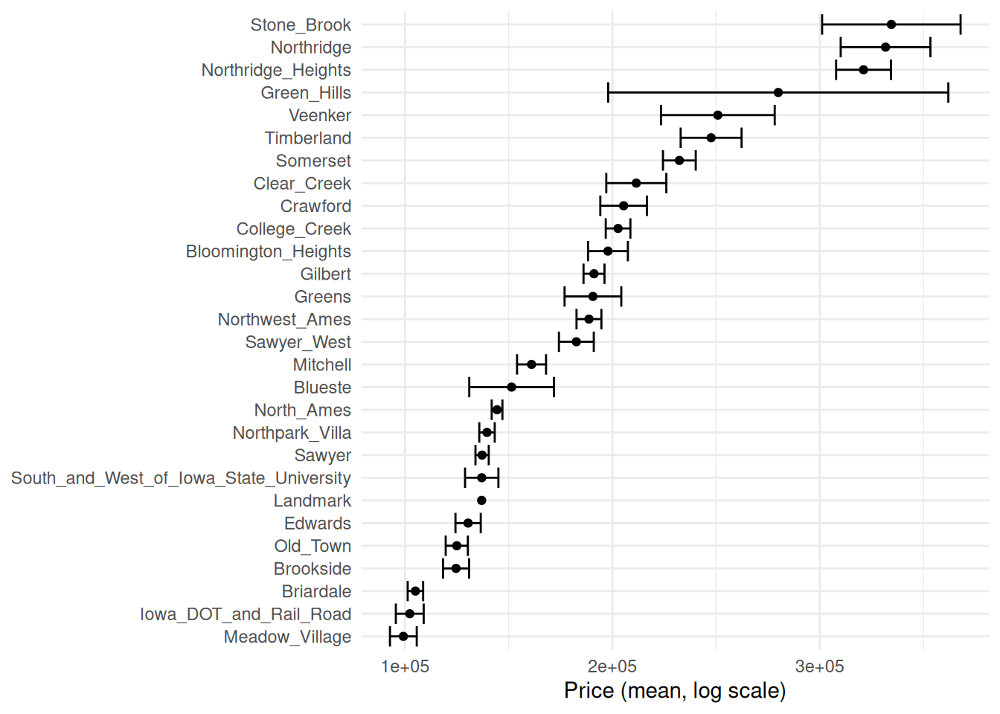
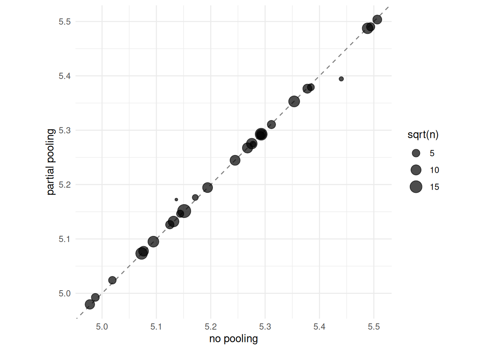

# Encoding Categorical Data

This vignette demonstrates categorical encoding techniques using
`embedmit`, closely following [Chapter 17 of Tidy Modeling with
R](https://www.tmwr.org/categorical) by Max Kuhn and Julia Silge.

## Introduction

For statistical modeling in R, the preferred representation for
categorical or nominal data is a *factor*, which is a variable that can
take on a limited number of different values. Internally, factors are
stored as a vector of integer values together with a set of text labels.

The most straightforward approach for transforming a categorical
variable to a numeric representation is to create dummy or indicator
variables from the levels. However, this approach does not work well
when you have a variable with high cardinality (too many levels) or when
you may encounter novel values at prediction time (new levels).

This vignette explores alternative encoding strategies that address
these challenges.

## Setup

Code

``` r
library(embedmit)
library(recipes)
library(dplyr)
library(tidyr)
library(rsample)
library(ggplot2)
library(purrr)
library(modeldata)
library(knitr)

# Load the Ames housing data
data(ames)

# Create train/test split
set.seed(502)
ames_split <- initial_split(ames, prop = 0.80, strata = Sale_Price)
ames_train <- training(ames_split)
ames_test <- testing(ames_split)
```

## Is an Encoding Necessary?

A minority of models, such as those based on trees or rules, can handle
categorical data natively and do not require encoding or transformation
of these kinds of features. For example: - **Tree-based models**
(decision trees, random forests, boosted trees) can find optimal splits
on categorical variables directly - **Naive Bayes** models compute class
probabilities without requiring numeric encoding - **Rule-based models**
can directly use categorical conditions

For these models, research has shown that creating dummy variables
typically does not improve performance and can increase computation
time. Starting with untransformed categorical variables when a model
allows it is often the best approach.

However, the majority of models require numeric representations for all
predictors. For these cases, we need encoding strategies.

## Dummy Variables

The most common approach is to create *dummy* or *indicator* variables
from the levels of a categorical variable. Table 17.1 shows how the
`Bldg_Type` variable in the Ames data (with five categories) can be
encoded using four dummy variables:

Code

``` r
bldg_types <- c("OneFam", "TwoFmCon", "Duplex", "Twnhs", "TwnhsE")

dummy_df <- tibble(
  `Bldg_Type` = bldg_types,
  `TwoFmCon` = c(0, 1, 0, 0, 0),
  `Duplex` = c(0, 0, 1, 0, 0),
  `Twnhs` = c(0, 0, 0, 1, 0),
  `TwnhsE` = c(0, 0, 0, 0, 1)
)

kable(dummy_df, align = "lcccc")
```

| Bldg_Type | TwoFmCon | Duplex | Twnhs | TwnhsE |
|:----------|:--------:|:------:|:-----:|:------:|
| OneFam    |    0     |   0    |   0   |   0    |
| TwoFmCon  |    1     |   0    |   0   |   0    |
| Duplex    |    0     |   1    |   0   |   0    |
| Twnhs     |    0     |   0    |   1   |   0    |
| TwnhsE    |    0     |   0    |   0   |   1    |

Table 17.1: Dummy variable encodings for building type categories.

The first factor level (`OneFam`) becomes the *reference level* and is
encoded as all zeros. One disadvantage of this approach is that the
reference level is absorbed into the intercept, making interpretation
less intuitive.

The `recipes` package provides
[`step_dummy()`](https://recipes.tidymodels.org/reference/step_dummy.html)
for standard dummy encoding when it is needed.

## Encoding Ordinal Predictors

Sometimes categorical predictors are *ordinal*, meaning there is a
natural ordering to the levels. For example, “none,” “a little,” “some,”
“a bunch,” “copious amounts” has a clear progression.

For ordinal variables, standard dummy encoding ignores the ordering
information. The `recipes` package offers polynomial expansions that
preserve ordinality. Table 17.2 shows the linear, quadratic, cubic, and
quartic polynomial expansions:

Code

``` r
ordinal_levels <- c("none", "a little", "some", "a bunch", "copious amounts")

ordinal_df <- tibble(
  Level = ordinal_levels,
  Linear = c(-0.632, -0.316, 0.000, 0.316, 0.632),
  Quadratic = c(0.535, -0.267, -0.535, -0.267, 0.535),
  Cubic = c(-0.316, 0.632, 0.000, -0.632, 0.316),
  Quartic = c(0.119, -0.478, 0.717, -0.478, 0.119)
)

kable(ordinal_df, digits = 3, align = "lcccc")
```

| Level           | Linear | Quadratic | Cubic  | Quartic |
|:----------------|:------:|:---------:|:------:|:-------:|
| none            | -0.632 |   0.535   | -0.316 |  0.119  |
| a little        | -0.316 |  -0.267   | 0.632  | -0.478  |
| some            | 0.000  |  -0.535   | 0.000  |  0.717  |
| a bunch         | 0.316  |  -0.267   | -0.632 | -0.478  |
| copious amounts | 0.632  |   0.535   | 0.316  |  0.119  |

Table 17.2: Polynomial expansions for ordinal predictors.

The linear column captures the main trend, quadratic captures curvature,
and so on. Consider using
[`step_unorder()`](https://recipes.tidymodels.org/reference/step_unorder.html)
to convert ordered factors to regular factors, or
[`step_ordinalscore()`](https://recipes.tidymodels.org/reference/step_ordinalscore.html)
to convert to numeric scores based on rank.

## Using the Outcome for Encoding Predictors

There are multiple options for encodings more complex than dummy or
indicator variables. One method called *effect* or *likelihood
encodings* replaces the original categorical variables with a single
numeric column that measures the effect of those data.

For example, for the Ames housing data, we can compute the mean or
median sale price for each neighborhood and use this value to represent
that categorical level. Effect encodings can also seamlessly handle
situations where a novel factor level is encountered in the data.

### Visualizing Neighborhood Effects

The Ames data has 28 different neighborhoods. Let’s visualize how sale
price varies across them:

Code

``` r
ames_train %>%
  group_by(Neighborhood) %>%
  summarize(
    mean = mean(Sale_Price),
    std_err = sd(Sale_Price) / sqrt(length(Sale_Price)),
    .groups = "drop"
  ) %>%
  ggplot(aes(y = reorder(Neighborhood, mean), x = mean)) +
  geom_point() +
  geom_errorbar(aes(xmin = mean - 1.64 * std_err, xmax = mean + 1.64 * std_err)) +
  labs(y = NULL, x = "Price (mean, log scale)") +
  theme_minimal()
```



Mean sale price by neighborhood with 90% confidence intervals.
Neighborhoods are ordered by their mean sale price.

### GLM-Based Effect Encoding

The
[`step_lencode_glm()`](https://rmsharp.github.io/embedmit/reference/step_lencode_glm.md)
function uses a generalized linear model to estimate the effect of each
category level:

Code

``` r
ames_glm <-
recipe(Sale_Price ~ Neighborhood + Gr_Liv_Area + Year_Built + Bldg_Type +
           Latitude + Longitude, data = ames_train) %>%
  step_log(Gr_Liv_Area, base = 10) %>%
  step_lencode_glm(Neighborhood, outcome = vars(Sale_Price)) %>%
  step_dummy(all_nominal_predictors()) %>%
  step_interact(~ Gr_Liv_Area:starts_with("Bldg_Type_")) %>%
  step_ns(Latitude, Longitude, deg_free = 20)

ames_glm
```

We can examine the learned encodings by preparing the recipe and using
[`tidy()`](https://generics.r-lib.org/reference/tidy.html):

Code

``` r
glm_estimates <-
  prep(ames_glm) %>%
  tidy(number = 2)

glm_estimates
#> # A tibble: 29 × 4
#>    level                value terms        id               
#>    <chr>                <dbl> <chr>        <chr>            
#>  1 North_Ames         144416. Neighborhood lencode_glm_yj20u
#>  2 College_Creek      202763. Neighborhood lencode_glm_yj20u
#>  3 Old_Town           124999. Neighborhood lencode_glm_yj20u
#>  4 Edwards            130460. Neighborhood lencode_glm_yj20u
#>  5 Somerset           232310. Neighborhood lencode_glm_yj20u
#>  6 Northridge_Heights 321119. Neighborhood lencode_glm_yj20u
#>  7 Gilbert            191159. Neighborhood lencode_glm_yj20u
#>  8 Sawyer             137208. Neighborhood lencode_glm_yj20u
#>  9 Northwest_Ames     188726. Neighborhood lencode_glm_yj20u
#> 10 Sawyer_West        182651. Neighborhood lencode_glm_yj20u
#> # ℹ 19 more rows
```

Each neighborhood is replaced by a single numeric value representing its
effect on sale price.

### Handling Novel Categories

Effect encodings can seamlessly handle situations where a novel factor
level is encountered in the data. The encoding includes a special
`..new` level:

Code

``` r
glm_estimates %>%
  filter(level == "..new")
#> # A tibble: 1 × 4
#>   level   value terms        id               
#>   <chr>   <dbl> <chr>        <chr>            
#> 1 ..new 183150. Neighborhood lencode_glm_yj20u
```

When the model encounters an unseen neighborhood at prediction time, it
uses this default encoding.

> **Important: Overfitting Risk with Effect Encodings**
>
> When you create an effect encoding for your categorical variable, you
> are effectively layering a mini-model inside your actual model. This
> supervised preprocessing **must be rigorously resampled** to avoid
> overfitting.
>
> The effect encoding should be estimated separately within each
> resample, just like model parameters. Using the tidymodels framework
> with `workflow()` ensures this happens automatically.

## Effect Encodings with Partial Pooling

Creating an effect encoding with
[`step_lencode_glm()`](https://rmsharp.github.io/embedmit/reference/step_lencode_glm.md)
estimates the effect separately for each factor level (in this case,
neighborhood). However, some of these neighborhoods have many houses in
them, and some have only a few. There is much more uncertainty in our
measurement of price for neighborhoods with few training set homes than
for neighborhoods with many.

We can use *partial pooling* to adjust these estimates so that levels
with small sample sizes are shrunk toward the overall mean. The
[`step_lencode_mixed()`](https://rmsharp.github.io/embedmit/reference/step_lencode_mixed.md)
function uses hierarchical or mixed effects models to accomplish this:

Code

``` r
ames_mixed <-
  recipe(Sale_Price ~ Neighborhood + Gr_Liv_Area + Year_Built + Bldg_Type +
           Latitude + Longitude, data = ames_train) %>%
  step_log(Gr_Liv_Area, base = 10) %>%
  step_lencode_mixed(Neighborhood, outcome = vars(Sale_Price)) %>%
  step_dummy(all_nominal_predictors()) %>%
  step_interact(~ Gr_Liv_Area:starts_with("Bldg_Type_")) %>%
  step_ns(Latitude, Longitude, deg_free = 20)

ames_mixed
```

Code

``` r
mixed_estimates <-
  prep(ames_mixed) %>%
  tidy(number = 2)

mixed_estimates
#> # A tibble: 29 × 4
#>    level                value terms        id                 
#>    <chr>                <dbl> <chr>        <chr>              
#>  1 North_Ames         144488. Neighborhood lencode_mixed_AmBz1
#>  2 College_Creek      202724. Neighborhood lencode_mixed_AmBz1
#>  3 Old_Town           125183. Neighborhood lencode_mixed_AmBz1
#>  4 Edwards            130698. Neighborhood lencode_mixed_AmBz1
#>  5 Somerset           232135. Neighborhood lencode_mixed_AmBz1
#>  6 Northridge_Heights 320533. Neighborhood lencode_mixed_AmBz1
#>  7 Gilbert            191145. Neighborhood lencode_mixed_AmBz1
#>  8 Sawyer             137433. Neighborhood lencode_mixed_AmBz1
#>  9 Northwest_Ames     188722. Neighborhood lencode_mixed_AmBz1
#> 10 Sawyer_West        182683. Neighborhood lencode_mixed_AmBz1
#> # ℹ 19 more rows
```

Code

``` r
mixed_estimates %>%
  filter(level == "..new")
#> # A tibble: 1 × 4
#>   level   value terms        id                 
#>   <chr>   <dbl> <chr>        <chr>              
#> 1 ..new 183225. Neighborhood lencode_mixed_AmBz1
```

### Comparing Pooling Methods

Let’s visualize how partial pooling affects the estimates:

Code

``` r
glm_estimates %>%
  rename(`no pooling` = value) %>%
  left_join(
    mixed_estimates %>%
      rename(`partial pooling` = value),
    by = "level"
  ) %>%
  left_join(
    ames_train %>%
      count(Neighborhood) %>%
      mutate(level = as.character(Neighborhood)),
    by = "level"
  ) %>%
  filter(!is.na(n)) %>%
  ggplot(aes(`no pooling`, `partial pooling`, size = sqrt(n))) +
  geom_abline(color = "gray50", lty = 2) +
  geom_point(alpha = 0.7) +
  coord_fixed() +
  labs(size = "sqrt(n)") +
  theme_minimal()
```



Comparison of GLM (no pooling) versus mixed effects (partial pooling)
encodings. Point size represents the number of observations in each
neighborhood.

When we use partial pooling, we shrink the effect estimates toward the
mean because we don’t have as much evidence about the price in
neighborhoods with few observations. Neighborhoods with many
observations retain estimates close to the unpooled GLM values.

### Bayesian Effect Encoding

For fully Bayesian uncertainty quantification,
[`step_lencode_bayes()`](https://rmsharp.github.io/embedmit/reference/step_lencode_bayes.md)
provides an alternative approach (requires the `rstanarm` package):

Code

``` r
ames_bayes <-
  recipe(Sale_Price ~ Neighborhood + Gr_Liv_Area + Year_Built + Bldg_Type +
           Latitude + Longitude, data = ames_train) %>%
  step_log(Gr_Liv_Area, base = 10) %>%
  step_lencode_bayes(Neighborhood, outcome = vars(Sale_Price)) %>%
  step_dummy(all_nominal_predictors()) %>%
  step_interact(~ Gr_Liv_Area:starts_with("Bldg_Type_")) %>%
  step_ns(Latitude, Longitude, deg_free = 20)
```

This approach provides full posterior distributions for each effect
estimate, allowing for uncertainty quantification in downstream
analyses.

## Feature Hashing

*Feature hashing* methods also create dummy variables, but only consider
the value of the category to assign it to a predefined pool of dummy
variables. A hashing function takes an input of variable size and maps
it to an output of fixed size.

Feature hashing has several advantages:

- **Memory efficient**: The number of columns is fixed regardless of
  cardinality
- **Handles novel categories**: New levels automatically get hashed
- **Fast**: Hash computation is very efficient

However, feature hashing is **not directly interpretable** because hash
functions cannot be reversed, and multiple categories can map to the
same hash value (collisions).

Code

``` r
library(rlang)

ames_hashed <-
  ames_train %>%
  mutate(Hash = map_chr(Neighborhood, hash))

ames_hashed %>%
  select(Neighborhood, Hash) %>%
  head(6)
#> # A tibble: 6 × 2
#>   Neighborhood    Hash                            
#>   <fct>           <chr>                           
#> 1 North_Ames      076543f71313e522efe157944169d919
#> 2 North_Ames      076543f71313e522efe157944169d919
#> 3 Briardale       b598bec306983e3e68a3118952df8cf0
#> 4 Briardale       b598bec306983e3e68a3118952df8cf0
#> 5 Northpark_Villa 6af95b5db968bf393e78188a81e0e1e4
#> 6 Northpark_Villa 6af95b5db968bf393e78188a81e0e1e4
```

In feature hashing, the number of possible hashes is a hyperparameter
and is set by the model developer through computing the modulo of the
integer hashes:

Code

``` r
ames_hashed %>%
  mutate(
    Hash = strtoi(substr(Hash, 26, 32), base = 16L),
    Hash = Hash %% 16
  ) %>%
  select(Neighborhood, Hash) %>%
  head(10)
#> # A tibble: 10 × 2
#>    Neighborhood     Hash
#>    <fct>           <dbl>
#>  1 North_Ames          9
#>  2 North_Ames          9
#>  3 Briardale           0
#>  4 Briardale           0
#>  5 Northpark_Villa     4
#>  6 Northpark_Villa     4
#>  7 Sawyer_West         9
#>  8 Sawyer_West         9
#>  9 Sawyer              8
#> 10 Sawyer              8
```

### Hash Collisions

When multiple categories map to the same hash value, this is called a
*collision*. Table 17.3 shows the collision frequency when hashing the
28 Ames neighborhoods into 16 buckets:

Code

``` r
collision_df <- ames_train %>%
  mutate(
    Hash = map_chr(Neighborhood, hash),
    Hash = strtoi(substr(Hash, 26, 32), base = 16L),
    Hash = Hash %% 16
  ) %>%
  distinct(Neighborhood, Hash) %>%
  count(Hash, name = "Neighborhoods") %>%
  arrange(Hash)

# Show summary
collision_summary <- collision_df %>%
  count(Neighborhoods, name = "Hash_Buckets") %>%
  arrange(desc(Neighborhoods))

kable(collision_summary,
      col.names = c("Neighborhoods per Bucket", "Number of Buckets"),
      align = "cc")
```

| Neighborhoods per Bucket | Number of Buckets |
|:------------------------:|:-----------------:|
|            4             |         2         |
|            3             |         3         |
|            2             |         2         |
|            1             |         7         |

Table 17.3: Hash collision frequency for Ames neighborhoods with 16 hash
buckets.

Using `signed = TRUE` in feature hashing can reduce the impact of
collisions by assigning +1 or -1 instead of just 1. The `textrecipes`
package provides `step_dummy_hash()` for this approach.

> **Choosing the Number of Hash Buckets**
>
> The number of hash buckets is a tuning parameter. More buckets mean
> fewer collisions but more columns. Consider using
> [`step_zv()`](https://recipes.tidymodels.org/reference/step_zv.html)
> after hashing to remove any zero-variance columns.

## Entity Embeddings

*Entity embeddings* use a neural network to learn a lower-dimensional
representation of categorical variables. This is particularly useful for
high-cardinality variables where dummy encoding would create too many
columns.

The
[`step_embed()`](https://rmsharp.github.io/embedmit/reference/step_embed.md)
function creates these learned embeddings:

Code

``` r
# Requires keras/tensorflow
ames_embed <-
  recipe(Sale_Price ~ Neighborhood + Gr_Liv_Area + Year_Built + Bldg_Type +
           Latitude + Longitude, data = ames_train) %>%
  step_log(Gr_Liv_Area, base = 10) %>%
  step_embed(Neighborhood, outcome = vars(Sale_Price),
             num_terms = 5,        # Number of embedding dimensions
             hidden_units = 10,    # Hidden layer size
             options = embed_control(epochs = 20)) %>%
  step_dummy(all_nominal_predictors()) %>%
  step_ns(Latitude, Longitude, deg_free = 20)
```

Key hyperparameters for entity embeddings include:

| Parameter      | Description                                     |
|----------------|-------------------------------------------------|
| `num_terms`    | Number of embedding dimensions (output columns) |
| `hidden_units` | Size of hidden layer in the neural network      |
| `epochs`       | Number of training passes through the data      |

Entity embeddings can capture complex nonlinear relationships between
categories and the outcome.

## Weight of Evidence

The *Weight of Evidence* (WoE) transformation is designed for binary
classification outcomes. It encodes each category level based on the
logarithm of the ratio of good/bad outcomes:
$$\text{WoE}_{i} = \ln\left( \frac{\text{Distribution of Events}_{i}}{\text{Distribution of Non-Events}_{i}} \right)$$

The
[`step_woe()`](https://rmsharp.github.io/embedmit/reference/step_woe.md)
function implements this encoding:

Code

``` r
# For binary outcome
binary_recipe <-
  recipe(outcome ~ category, data = binary_data) %>%
  step_woe(category, outcome = vars(outcome))
```

WoE is particularly popular in credit scoring and risk modeling
applications. Positive WoE values indicate categories associated with
higher event rates.

## Summary of Encoding Options

The `embedmit` package offers multiple encoding strategies. The choice
depends on your specific situation:

| Function                                                                                     | Best For                                  | Handles Novel Levels | Interpretable |
|----------------------------------------------------------------------------------------------|-------------------------------------------|----------------------|---------------|
| [`step_dummy()`](https://recipes.tidymodels.org/reference/step_dummy.html)                   | Low cardinality, linear models            | No                   | Yes           |
| [`step_lencode_glm()`](https://rmsharp.github.io/embedmit/reference/step_lencode_glm.md)     | Medium cardinality, linear effects        | Yes                  | Yes           |
| [`step_lencode_mixed()`](https://rmsharp.github.io/embedmit/reference/step_lencode_mixed.md) | Sparse categories, need shrinkage         | Yes                  | Yes           |
| [`step_lencode_bayes()`](https://rmsharp.github.io/embedmit/reference/step_lencode_bayes.md) | Uncertainty quantification                | Yes                  | Yes           |
| [`step_embed()`](https://rmsharp.github.io/embedmit/reference/step_embed.md)                 | High cardinality, complex relationships   | Yes                  | No            |
| [`step_woe()`](https://rmsharp.github.io/embedmit/reference/step_woe.md)                     | Binary outcomes, risk modeling            | Yes                  | Somewhat      |
| [`step_feature_hash()`](https://rmsharp.github.io/embedmit/reference/step_feature_hash.md)   | Very high cardinality, memory constraints | Yes                  | No            |

## Chapter Summary

The most straightforward option for transforming a categorical variable
to a numeric representation is to create dummy variables from the
levels, but this option does not work well when you have a variable with
high cardinality (too many levels) or when you may see novel values at
prediction time (new levels).

**Key takeaways:**

1.  **Consider native handling first**: Tree-based models and Naive
    Bayes can handle categories directly
2.  **Effect encodings** replace categories with a single numeric value
    measuring the outcome relationship
3.  **Partial pooling** (via
    [`step_lencode_mixed()`](https://rmsharp.github.io/embedmit/reference/step_lencode_mixed.md))
    adjusts estimates so that levels with small sample sizes are shrunk
    toward the overall mean
4.  **Feature hashing** maps categories to a predefined pool of dummy
    variables and can handle novel categories
5.  **Entity embeddings** learn complex representations via neural
    networks
6.  **Always resample** supervised encodings to avoid overfitting

## References

- Kuhn, M., & Johnson, K. (2019). *Feature Engineering and Selection*.
  CRC Press.
- Kuhn, M., & Silge, J. (2022). *Tidy Modeling with R*. O’Reilly Media.
- Micci-Barreca, D. (2001). A preprocessing scheme for high-cardinality
  categorical attributes in classification and prediction problems. *ACM
  SIGKDD Explorations*, 3(1), 27-32.
- Guo, C., & Berkhahn, F. (2016). Entity embeddings of categorical
  variables. *arXiv preprint arXiv:1604.06737*.
